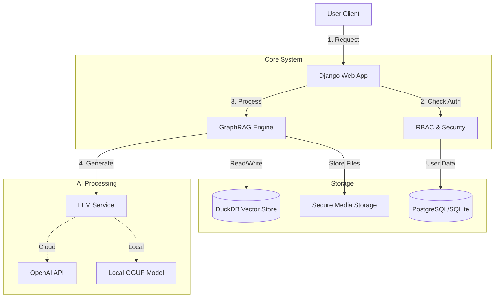

# GraphRAG Marketplace

A lightweight, production-ready GraphRAG application with role-based access control and enterprise security features.

## Features

- **GraphRAG Engine**: DuckDB + LangGraph for intelligent document Q&A
- **Role-Based Access Control**: Three-tier permission system (Admin, Creator, User)
- **Public & Private Spaces**: Flexible knowledge sharing
- **Secure Media**: Protected document access
- **Force Password Change**: Security-first user onboarding
- **WhatsApp-style Chat UI**: Intuitive user experience

## Architecture



## Quick Start

### Windows
```bash
run.bat
```

### Linux
```bash
chmod +x run.sh
./run.sh
```

The server will start at `http://127.0.0.1:8000`

## Default Admin Credentials
- **Username**: `admin`
- **Password**: `admin`

> **Important**: Change the default password immediately after first login.

## User Roles

### Platform Admin
- Full system access
- Manage all users and spaces
- Assign any role

### Knowledge Base Creator
- Create and manage knowledge spaces
- Create Standard Users and Creators
- Access user management dashboard
- Cannot modify Platform Admins

### Standard User
- View public spaces
- Access invited private spaces
- Cannot create spaces or access admin features

## Supported File Formats

### Document Upload
- **PDF** (`.pdf`) - Automatically parsed and chunked
- **Text Files** (`.txt`, `.md`, `.csv`, etc.) - Plain text extraction

### URL Ingestion
- Any web page accessible via HTTP/HTTPS
- Automatically extracts and processes content

**Note:** All uploaded documents and URLs are:
1. Automatically chunked based on `CHUNK_SIZE` setting
2. Embedded using sentence-transformers
3. Stored in DuckDB vector store
4. Summarized using the configured LLM

## Configuration

### Marketplace Title
Edit `graphrag_marketplace/settings.py`:
```python
MARKETPLACE_TITLE = "Your Custom Title"
```

### LLM Configuration

The system supports multiple LLM providers with automatic fallback:

#### Option 1: OpenAI (Recommended for Production)
Set your API key as an environment variable:
```bash
# Windows
set OPENAI_API_KEY=your-api-key-here

# Linux/Mac
export OPENAI_API_KEY=your-api-key-here
```

**Recommended Models:**
- `gpt-4-turbo` - Best quality, higher cost
- `gpt-3.5-turbo` - Good balance, lower cost (default)

#### Option 2: Local LLM (Privacy-First, No API Costs)
The system automatically downloads and uses **Qwen2.5-7B-Instruct** (4.68GB) with:
- **32K context window**
- **Offline operation**
- **No API costs**
- **Privacy-preserving**

**Custom Model Path:**
```bash
# Windows
set LLM_MODEL_PATH=models/your-model.gguf

# Linux/Mac
export LLM_MODEL_PATH=models/your-model.gguf
```

**Supported Models:** Any GGUF format model compatible with llama.cpp

#### Priority Order
1. OpenAI API (if `OPENAI_API_KEY` is set)
2. Local GGUF model (automatic fallback)
3. Context-only response (if no LLM available)

### Advanced LLM Configuration

All LLM settings can be configured via environment variables or in `graphrag_marketplace/settings.py`:

#### Context Window Size
Controls how much text the LLM can process at once (input + output combined).

```bash
# Windows
set LLM_CONTEXT_SIZE=8192

# Linux/Mac
export LLM_CONTEXT_SIZE=8192
```

**Recommendations:**
- `4096` - Safe for most systems (4GB+ RAM)
- `8192` - Default, good balance (8GB+ RAM recommended)
- `16384` - Better for long documents (16GB+ RAM)
- `32768` - Maximum for Qwen2.5-7B (32GB+ RAM or GPU required)

**Note:** Higher context sizes require more RAM/VRAM. If you see "Failed to create llama_context" errors, reduce this value.

#### Document Chunking
Controls how documents are split for processing and retrieval.

```bash
# Chunk size (characters per chunk)
set CHUNK_SIZE=500

# Overlap between chunks (helps maintain context)
set CHUNK_OVERLAP=50
```

**Recommendations:**
- Smaller chunks (300-500): Better for precise retrieval
- Larger chunks (800-1200): Better for maintaining context
- Overlap: 10-20% of chunk size

#### GPU Offloading
```bash
# Number of layers to offload to GPU (-1 = all layers)
set LLM_GPU_LAYERS=-1
```

### Document Summarization

The system automatically generates AI summaries for all uploaded documents and ingested URLs. Summaries are:
- Generated using the configured LLM (OpenAI or Local)
- Stored in the database for quick access
- Viewable by clicking the info icon next to each document
- Used to help users understand document contents at a glance

**Note:** Summarization uses the same `LLM_CONTEXT_SIZE` setting. For very large documents, only the first ~4000 characters are summarized.

### 3. GPU & Remote Inference Setup

#### Option A: Local GPU (Same Machine)
If you have a GPU (NVIDIA/Apple Silicon) on the same machine, you can offload layers to it for faster inference.

1.  **Re-install `llama-cpp-python` with hardware support:**
    *   **NVIDIA (CUDA):**
        ```bash
        set CMAKE_ARGS=-DGGML_CUDA=on
        pip install llama-cpp-python --upgrade --force-reinstall --no-cache-dir
        ```
    *   **Apple Silicon (Metal):**
        ```bash
        set CMAKE_ARGS=-DGGML_METAL=on
        pip install llama-cpp-python --upgrade --force-reinstall --no-cache-dir
        ```

2.  **Configure Offloading:**
    Set the number of layers to offload to GPU (set to `-1` for all layers).
    ```bash
    set LLM_GPU_LAYERS=-1
    ```

#### Option B: Remote GPU Server (Separate Machine)
If your GPU is on a different machine (e.g., a Linux server with vLLM or TGI), you can connect GraphRAG to it via the OpenAI-compatible API.

1.  **Start the Inference Server (on remote machine):**
    *   Example with `vLLM`:
        ```bash
        vllm serve Qwen/Qwen2.5-7B-Instruct --api-key mysecretkey
        ```
    *   Example with `llama-cpp-python`:
        ```bash
        python -m llama_cpp.server --model models/my-model.gguf --host 0.0.0.0 --port 8000
        ```

2.  **Configure GraphRAG (on this machine):**
    Point the application to your remote server.
    ```bash
    set OPENAI_API_KEY=mysecretkey  # Use "dummy" if server has no auth
    set OPENAI_API_BASE=http://<remote-ip>:8000/v1
    ```
    *Note: When `OPENAI_API_BASE` is set, the local model download is skipped.*

#### Option 3: OpenRouter / Generic OpenAI-Compatible API
You can connect to **OpenRouter**, **Groq**, **Together AI**, or any other provider that supports the OpenAI format.

**Configuration:**
```bash
# Example: OpenRouter
set OPENAI_API_KEY=sk-or-v1-your-key
set OPENAI_API_BASE=https://openrouter.ai/api/v1
set LLM_MODEL_NAME=google/gemini-pro-1.5  # Specify the model you want to use
```

**Note:** When `OPENAI_API_BASE` is set, the system will use it as the primary LLM provider.

## Testing

```bash
python manage.py test core
```

## Testing & Maintenance Disclaimer

> **⚠️ Important Notice**
> 
> - **Testing Coverage**: The current test suite focuses on **local connection and core functionality** only. Testing through AI API endpoints and port configurations is **not fully covered**. Only test on windows environment.
> - **Maintenance Status**: This project is maintained on a **low-maintenance basis**. Updates and bug fixes may not be immediate.
> - **Contributors Welcome**: We welcome developers interested in joining the maintenance effort! If you'd like to contribute, improve test coverage, or help maintain this project, please feel free to submit pull requests or reach out.

## Security Features

- **Password Security**: Passwords are **securely hashed** using PBKDF2 (SHA256) with a salt before storage. They are **never** stored in plain text, regardless of the database used (SQLite, PostgreSQL, etc.).
- **Password Policy**: Forced password change on first login.
- **Role Hierarchy**: Prevents privilege escalation.
- **Protected Media**: Permission-based document access.
- **Information Minimization**: Users see only relevant data.
- **CSRF Protection**: Secure forms and logout.

## Privacy Features

🔒 **Zero Conversation Logging** - Your questions and answers are **never stored** in the database:
- No chat history is saved
- No tracking of who asked what
- No conversation logs in the database
- Questions are processed in real-time and discarded after response

This ensures:
- ✅ **Complete Privacy** - Your queries remain confidential
- ✅ **No Audit Trail** - Questions cannot be reviewed or monitored
- ✅ **GDPR Friendly** - No personal conversation data is retained
- ✅ **Secure by Design** - Even database administrators cannot see your questions

**What IS Stored:**
- User accounts and permissions
- Uploaded documents and their summaries
- Document metadata (title, upload date)
- Space configurations

**What is NOT Stored:**
- Chat messages or questions
- User queries or search terms
- AI responses or answers
- Conversation history

> **Note:** If you need conversation logging for compliance or audit purposes, you would need to implement a separate `ChatHistory` model and modify the `chat_api` view.

## Enterprise Features

- **LDAP-Ready**: Uncomment LDAP settings for enterprise authentication
- **Audit Trail**: User creation tracking
- **Flexible Permissions**: Space-level owner/member roles
- **Scalable Architecture**: Django + DuckDB for performance

## Production Deployment

For production deployment, see: [Django Deployment Guide](https://docs.djangoproject.com/en/5.2/howto/deployment/)

**Key Steps:**
1. Set `DEBUG = False` in settings
2. Configure `ALLOWED_HOSTS`
3. Set up proper database (PostgreSQL recommended)
4. Configure static file serving
5. Enable HTTPS
6. Set strong `SECRET_KEY`

## License

MIT License - See [LICENSE](LICENSE) file for details.

**Disclaimer**: This software is provided "AS IS" without warranty of any kind. The authors are not liable for any damages or issues arising from the use of this software.
